---
# try also 'default' to start simple
theme: seriph
# random image from a curated Unsplash collection by Anthony
# like them? see https://unsplash.com/collections/94734566/slidev
background: ./assets/bg.jpg
# some information about your slides (markdown enabled)
title: Welcome to Slidev
info: |
  ## Slidev Starter Template
  Presentation slides for developers.

  Learn more at [Sli.dev](https://sli.dev)
# apply UnoCSS classes to the current slide
class: text-center
# https://sli.dev/features/drawing
drawings:
  persist: false
# slide transition: https://sli.dev/guide/animations.html#slide-transitions
transition: slide-left
# enable MDC Syntax: https://sli.dev/features/mdc
mdc: true
# duration of the presentation
duration: 35min
---

# Welcome

Ai checkpoint 1 for Agriculture desease detection.

---
layout: center
---

# Preparing the data

Our dataset is naturally just images, with labled categories.

Our current categoris are `bligh`, `common_rust`, `healthy`, `gray_leaf_spot`.

Images are stored in directories grouped by there respective category.

And the data is prepared by a script that loads the images and normalizing the category names, and outputs a csv file containg the image path, and the category.

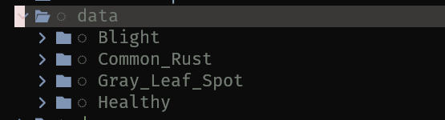

---

Images are resized to be only one size that the model encoder expects.

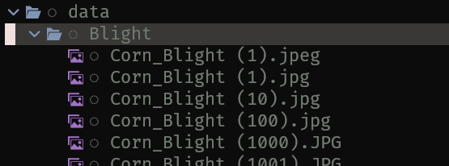

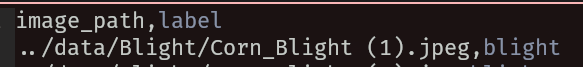

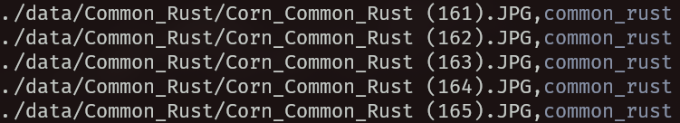

---

# Model Tech Stack

- Ludwig: An abstraction over TensorFlow and other solutions to make configuring and versioning AI models easier, reducing boilerplate, Created By: Uber.
- Fast API: To create the rest service for communicating from the main backend.

---

## Model Input Explanation

The input layer is handled via `ResNet` encoder, which converts images to vectors/numbers so that it can be an input for the NN.

Then currently there is only one hidden layer in between input and output.

Then the output layer is one Neuron for each categoty (encoded)

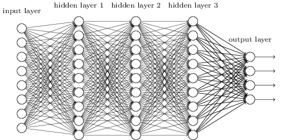</img>

---

# Model Configuration: Input

```yaml {all|2-8|9-}
input_features:
  - name: image_path
    type: image
    encoder:
        type: resnet
        model_variant: 50
        pretrained: true
        trainable: true
    preprocessing:
      augmentation:
        - type: random_horizontal_flip
        - type: random_vertical_flip
        - type: random_rotate
          degree: 20
        - type: random_blur
          kernel_size: 3
        - type: random_brightness
          min: 0.5
          max: 2.0
        - type: random_contrast
          min: 0.5
          max: 2.0
```

---

## Model Configuration: Output

```yaml {all|1-7|9-12|14-}
output_features:
  - name: label
    type: category
    decoder:
      num_fc_layers: 1
      fc_output_size: 128
      fc_dropout: 0.4

preprocessing:
  split:
    type: random
    probabilities: [0.8, 0.1, 0.1] # [Train, Validation, Test]

trainer:
  epochs: 30
  early_stop: 5
  learning_rate: 0.0001
  optimizer:
    type: adam
```

---

# Model Visualization And Evaluation

## Frequency vs F1

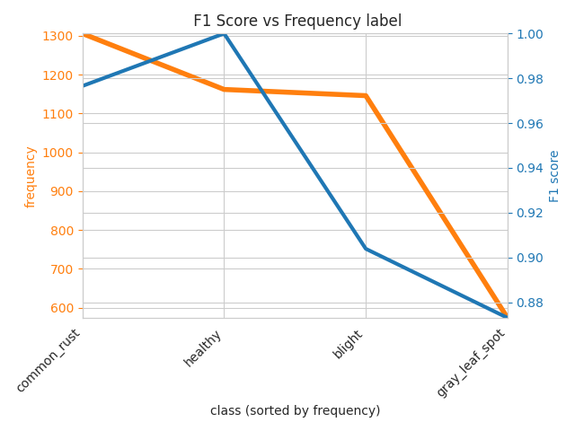

---

# Model Visualization And Evaluation

## Confusion Matrix


---

# Model Visualization And Evaluation

## Confusion Matrix Entropy


---

# Model Visualization And Evaluation

## Learning Rate

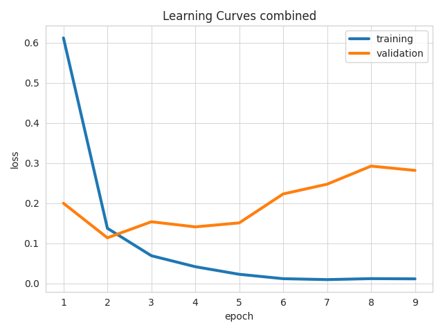

---

# The server

```python
print("Loading model...")
model = LudwigModel.load("./model/results/prod/model")
print("Model loaded.")

class PredictOutput(BaseModel):
    label: str
    probability_blight: float
    probability_common_rust: float
    probability_gray_leaf_spot: float
    probability_healthy: float

@app.post("/predict")
async def predict(input: UploadFile = File(...)) -> PredictOutput:
    # loading of file upload and running the model 

    data = {
        "label": predictions["label_predictions"][0],
        "probability_blight": predictions["label_probabilities_blight"],
        "probability_common_rust": predictions["label_probabilities_common_rust"],
        "probability_gray_leaf_spot": predictions["label_probabilities_gray_leaf_spot"],
        "probability_healthy": predictions["label_probabilities_healthy"],
    }

    return PredictOutput(**data)
```

---

# Server Documentation And Client generation

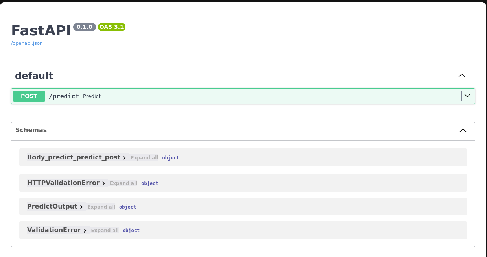

---

The predict endpoint returns the most propable category, and the percentages of all categories.


---

The service has a spec so that we can generate a client for the service easily.

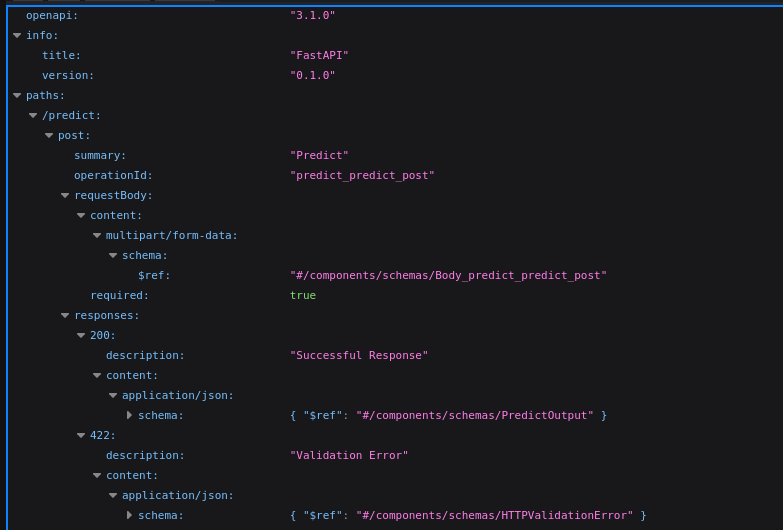

---

Example of a client generated from spec.

```ts
import { predictPredictPost } from "./client/sdk.gen";

const file = Bun.file("./test-image.jpeg");
const { data, error } = await predictPredictPost({
  body: {
    input: new Blob([await file.arrayBuffer()]),
  },
  baseUrl: "http://localhost:8000",
});

if (error) throw new Error("Prediction failed");

console.log(data);
```

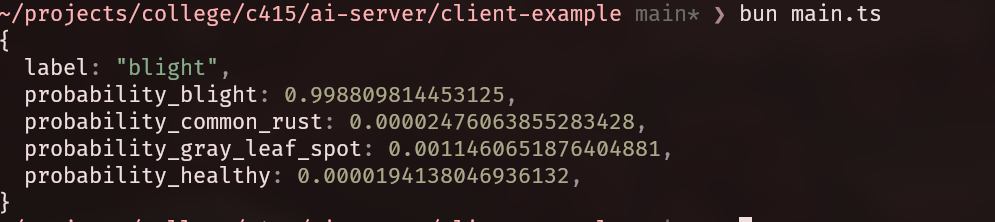

---

# Deployment

## Builder

```docker
# syntax=docker/dockerfile:1

FROM python:3.8-slim AS builder

WORKDIR /build

RUN apt-get update && apt-get install -y \
    build-essential \
    && rm -rf /var/lib/apt/lists/*

RUN python -m venv /opt/venv
ENV PATH="/opt/venv/bin:$PATH"

COPY requirements.txt .

# Mount the pip cache directory. 
# We remove '--no-cache-dir' so pip writes to the mounted cache.
RUN --mount=type=cache,target=/root/.cache/pip \
    pip install -r requirements.txt
```

---

## Runner

```docker
FROM python:3.8-slim

WORKDIR /server

COPY --from=builder /opt/venv /opt/venv

ENV PATH="/opt/venv/bin:$PATH"

COPY server.py .

COPY ./model/results/prod/model ./model/results/prod/model

EXPOSE 8000

CMD ["fastapi", "run", "server.py", "--port", "8000"]
```

---

## DockerHub and railway

The image is built and pushed to DockerHub.

And then it's used to create a container on Railway


---

## Stats of the running container on Railway

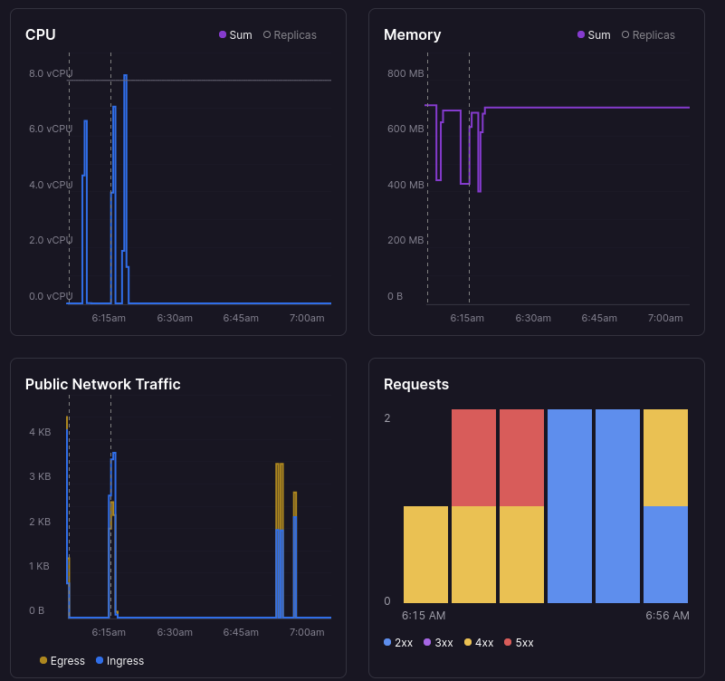

---

# Demo of Deployed model

[https://greenshield-ai-service.up.railway.app/docs](https://greenshield-ai-service.up.railway.app/docs)


---
layout: center
---

# Thank You
